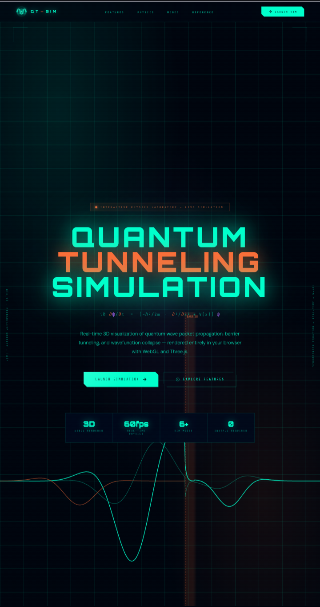

# ⚛ QT-SIM — Quantum Tunneling Simulation

<div align="center">



**Real-time 3D visualization of quantum wave packet propagation, barrier tunneling, and wavefunction collapse — rendered entirely in your browser.**

[](https://nazat02.github.io/Quantum-Tunneling/)


</div>

---

## 🔬 What is Quantum Tunneling?

Quantum tunneling is a phenomenon where a particle passes through a potential energy barrier that it classically could not surmount. It's a consequence of the wave-like nature of quantum mechanical particles — described by the **Schrödinger equation**:

$$i\hbar \frac{\partial \psi}{\partial t} = \left[ -\frac{\hbar^2}{2m} \frac{\partial^2}{\partial x^2} + V(x) \right] \psi$$

Where:
- `ψ(x, t)` — the quantum wavefunction (probability amplitude)
- `V(x)` — the potential barrier
- `ℏ` — the reduced Planck constant
- `m` — particle mass

This simulation solves a discretized version of this equation in real time, letting you visualize the full quantum state — incident wave, evanescent decay inside the barrier, and the transmitted wave packet on the other side.

---

## ✨ Features

### 🌐 3D Probability Field
- Full **3D WebGL rendering** powered by Three.js
- Visualize the quantum probability cloud `|ψ|²` as a volumetric particle system
- Toggle between **Cloud mode** (particle scatter) and **Surface mode** (mesh topology)
- Optional **3D Sphere** visualization of the wavefunction

### 📊 Live Wavefunction Graph
- Real-time 2D oscilloscope-style plot at the bottom of the screen
- Shows **Re(ψ)**, **Im(ψ)**, and **|ψ|²** simultaneously
- Color-coded: teal = real part, purple = imaginary, orange = probability density
- Animated barrier region with evanescent decay visible

### 🎛 Interactive Controls
| Parameter | Description |
|-----------|-------------|
| **Energy E** | Kinetic energy of the incoming wave packet |
| **Barrier V₀** | Height of the potential barrier |
| **Width d** | Thickness of the barrier |
| **Mass m** | Effective particle mass |
| **Packet σ** | Width (spread) of the Gaussian wave packet |
| **Speed** | Simulation playback speed multiplier |

### ⚡ Quantum Measurement
- Hit **MEASURE** to collapse the wavefunction — watch the probability cloud snap to a single location
- Observe the difference between pre- and post-measurement quantum states

### 📱 Mobile-First Design
- Fully responsive on phones and tablets
- Bottom sheet panel slides up for controls (swipe or tap)
- Touch-optimized sliders and buttons
- Hardware-accelerated rendering on mobile GPUs

### 🔢 Live Data Readout
- **Transmission coefficient T** — probability of tunneling through
- **Reflection coefficient R** — probability of bouncing back
- **Energy level** relative to barrier height
- Updates continuously as parameters change

---

## 🗂 Project Structure

```
qt-sim/
├── index.html       # Landing page (entry point)
├── sim.html         # Main simulation app
├── preview.png      # README preview image
└── README.md        # This file
```

---

## 🚀 Getting Started

### Option 1 — GitHub Pages (Recommended)

1. Fork or clone this repository
2. Go to **Settings → Pages**
3. Set source to `main` branch, root folder
4. Your site will be live at `https://nazat02.github.io/Quantum-Tunneling/`

### Option 2 — Run Locally

No build tools needed. Just open the files directly:

```bash
git clone https://github.com/nazat02/Quantum-Tunneling.git
cd Quantum-Tunneling

# Open in browser (any of these work)
open index.html          # macOS
start index.html         # Windows
xdg-open index.html      # Linux
```

Or serve with a local server (avoids any CORS issues):

```bash
# Python
python -m http.server 8080

# Node
npx serve .
```

Then visit `http://localhost:8080`

---

## 🎮 How to Use

### Landing Page
- Click **Launch Simulation** to open the 3D sim
- Scroll down to read about the physics, features, and modes

### Simulation Page
| Action | Control |
|--------|---------|
| Rotate view | Drag / one-finger swipe |
| Zoom | Scroll wheel / pinch |
| Auto-orbit | Double-click / double-tap |
| Open controls | Tap **CONTROLS & DATA** bar (mobile) |
| Reset simulation | Press **RESET** |
| Pause / Resume | Press **PAUSE** |
| Collapse wavefunction | Press **MEASURE** |
| Switch render mode | **CLOUD / SURFACE** toggle |
| Go back to landing | Arrow `←` button (top-left) |

---

## ⚙️ Physics Details

### Numerical Method
The simulation uses a **split-operator Fourier method** to evolve the wavefunction in time:

1. Apply half-step potential phase: `ψ → e^{-iV·Δt/2ℏ} · ψ`
2. FFT to momentum space
3. Apply kinetic phase: `ψ̂ → e^{-ik²Δt/2mℏ} · ψ̂`
4. Inverse FFT back to position space
5. Apply second half-step potential phase

This method is **unitary** (norm-preserving), **second-order accurate** in time, and extremely efficient for 1D and quasi-3D problems.

### Transmission Coefficient
The tunneling probability for a rectangular barrier is:

$$T = \left[1 + \frac{V_0^2 \sinh^2(\kappa d)}{4E(V_0 - E)}\right]^{-1}$$

Where `κ = √(2m(V₀ - E)) / ℏ` is the decay constant inside the barrier.

### Wave Packet
The initial state is a **Gaussian wave packet**:

$$\psi(x, 0) = \frac{1}{(2\pi\sigma^2)^{1/4}} \exp\left(-\frac{(x-x_0)^2}{4\sigma^2} + ik_0 x\right)$$

Centered at `x₀` with momentum `k₀ = √(2mE)/ℏ` and spatial spread `σ`.

---

## 🛠 Tech Stack

| Technology | Role |
|-----------|------|
| **Three.js** | 3D WebGL rendering engine |
| **HTML5 Canvas** | 2D wavefunction graph |
| **Web Audio API** | *(reserved for future audio feedback)* |
| **Orbitron** | HUD display font |
| **Share Tech Mono** | Data readout font |
| **DM Sans** | Body text font |

No npm. No bundler. No framework. Pure browser-native.

---

## 🎨 Design System

The UI uses a consistent dark sci-fi aesthetic:

| Token | Value | Use |
|-------|-------|-----|
| Teal | `#00ffcc` | Primary color, wavefunction |
| Orange | `#ff6b35` | Barrier, warnings, accents |
| Purple | `#b06aff` | Imaginary part, tunneled particle |
| Background | `#00040d` | Deep space black |

---

## 📐 Roadmap

- [ ] Double-barrier resonance tunneling mode
- [ ] 2D barrier geometry editor
- [ ] Export wavefunction data as CSV
- [ ] Audio sonification of tunneling probability
- [ ] Step barrier and triangular barrier shapes
- [ ] Multi-particle entanglement visualization

---

## 📄 License

MIT License — free to use, modify, and distribute. See [`LICENSE`](LICENSE) for details.

---

## 🙏 Acknowledgements

- [Three.js](https://threejs.org/) — 3D rendering
- Inspired by quantum mechanics coursework and the beauty of wave-particle duality
- Built as an interactive physics education tool

---

<div align="center">

Made with ⚛ and `#00ffcc`

**[🚀 Launch Simulation](https://nazat02.github.io/Quantum-Tunneling/)**

</div>
